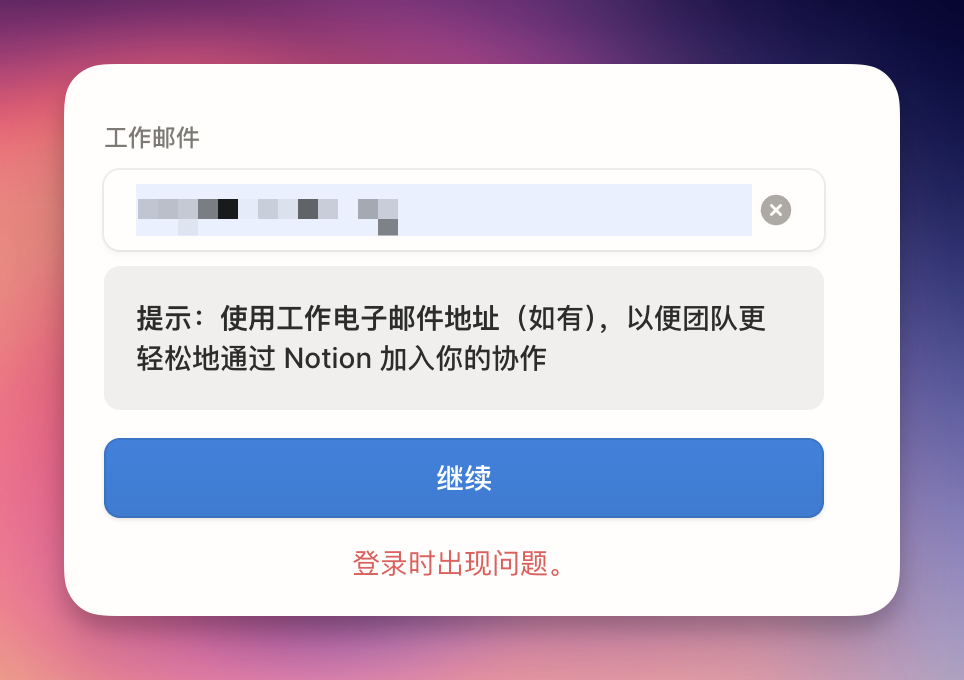

## 最近，你的 Notion 还能正常登录吗？

最近，不少小伙伴反馈使用教育邮箱登录时提示错误。

这并不是你的账号出了问题，而是 Notion 官方最近优化了安全验证机制。由于教育邮箱（尤其是某些非主流后缀）在接收海外邮件时可能存在延迟或屏蔽，单一的登录方式风险正在增加。

如果无法登录，可以试试切换网络，或者关闭 VPN 等方式进行登录。

## 二、 避坑指南：必须马上做的两件事

好消息是，Notion 最近上线了**“多邮箱”**功能。登录成功或者已经是登录状态的用户请添加备用邮箱。添加备用邮箱后，这些邮件地址都可以用来登录账户、接收邀请和提及。这样的话，即使你的主邮箱无法使用，也不会失去对账户的访问权限。这对使用教育邮箱的账户很有帮助！

添加备用邮箱可以按照下面视频操作。

## 三、 为什么你依然需要一个“教育版”？

现在可以添加多个邮箱， Notion Plus (Education Plan) 基本没有风险， 添加一个邮箱你就可以拥有以下功能：

* 无限图表使用

* 无限自动化

* 无限 Block 存储： 告别 5MB 附件限制，高清图片、PDF 随便传。

* 30 天历史版本回溯： 写错代码、误删页面？一键找回。

如果你还没升级到教育版，或者还在为寻找稳定的教育邮箱发愁，可以扫描下面的二维码购买。

## 四、 写在最后

Notion 是我们第二大脑，数据的安全性永远是第一位。
看到这篇文章的小伙伴，请立刻去设置里检查是否绑定了备用邮箱！

如有任何登录或升级问题，欢迎在后台留言，我会一一解答。